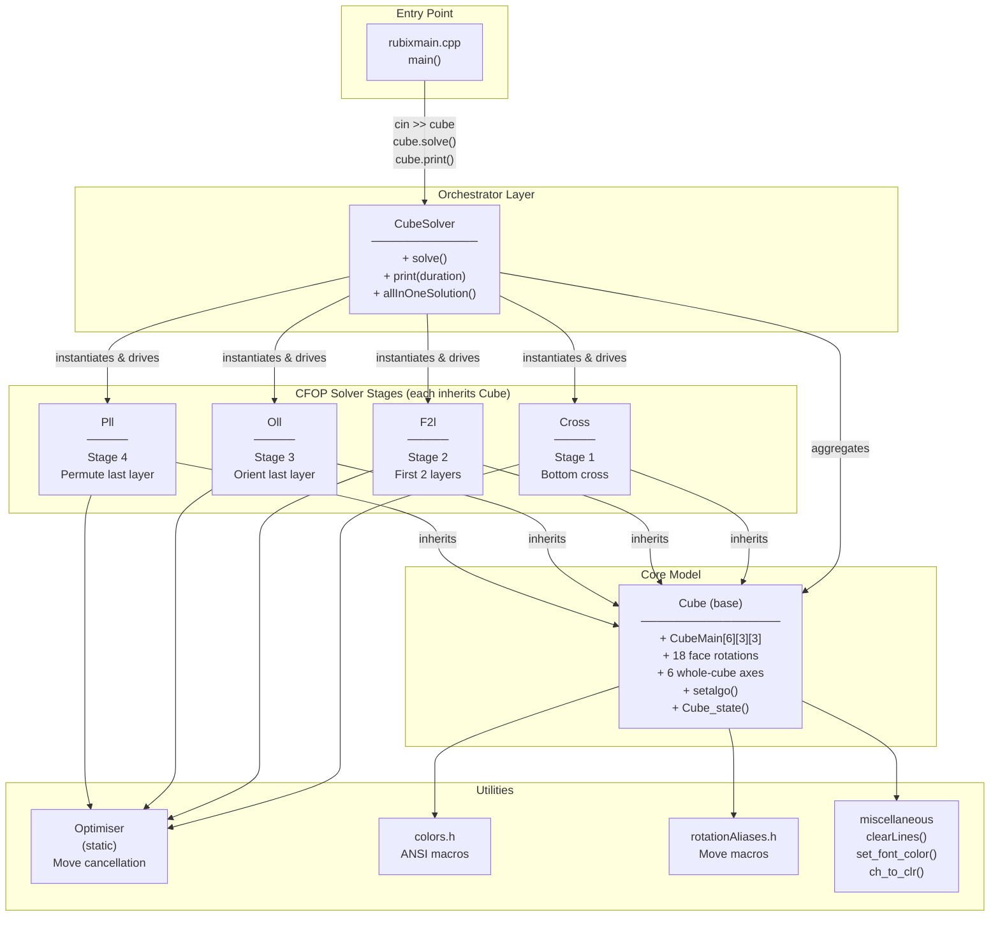
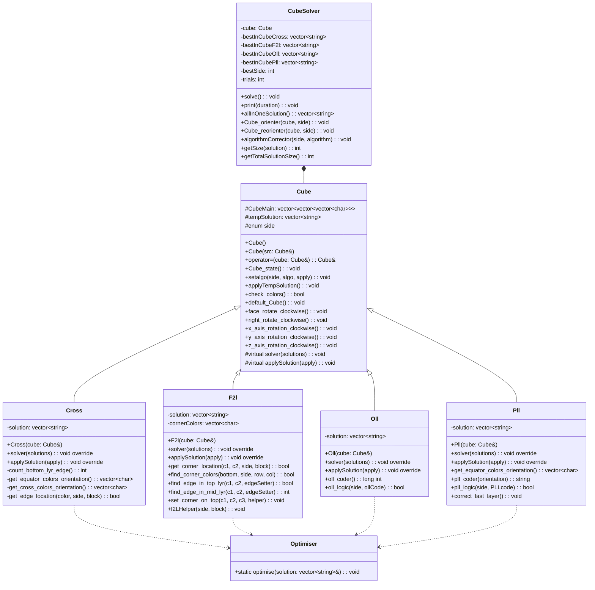

# Architecture — Rubik's Cube Solver

> Generated: 2026-04-02 | Language: C++17 | Algorithm: CFOP

---

## Table of Contents

1. [System Overview](#1-system-overview)
2. [Architecture Diagram](#2-architecture-diagram)
3. [Data Flow Diagram](#3-data-flow-diagram)
4. [Core Data Model](#4-core-data-model)
5. [Class Hierarchy](#5-class-hierarchy)
6. [Component Reference](#6-component-reference)
7. [Key Design Patterns](#7-key-design-patterns)
8. [Move Execution Pipeline](#8-move-execution-pipeline)
9. [Optimisation Strategy](#9-optimisation-strategy)
10. [Extension Guide](#10-extension-guide)

---

## 1. System Overview

The solver is a **single-process, interactive CLI application**. There is no client–server split, no network communication, and no external database. The entire system runs in one binary compiled from C++ sources.

The program lifecycle is:

```
stdin  →  Cube input validation  →  CFOP solve engine  →  stdout (ANSI terminal)
```

The **CFOP method** decomposes solving into four sequential, independent stages. Each stage produces one or more candidate move sequences. The `CubeSolver` orchestrator runs the full pipeline once for **each of the six cube orientations** (6 × N trials) and keeps the globally shortest total solution.

---

## 2. Architecture Diagram



---

## 3. Data Flow Diagram

The sequence below shows the primary solve flow from user input to printed solution.

```mermaid
sequenceDiagram
    actor User
    participant main as rubixmain.cpp
    participant CS as CubeSolver
    participant Cube as Cube (base)
    participant CRS as Cross
    participant F2L as F2l
    participant OLL as Oll
    participant PLL as Pll
    participant OPT as Optimiser

    User->>main: launch ./rubiks_cube_solver
    main->>CS: printTitle() + printBanner()
    main->>CS: cin >> solver  (forwards to Cube)
    CS->>Cube: operator>>(istream) — enter 54 stickers
    Cube->>Cube: check_colors() — validate 9 of each color
    alt invalid input
        Cube-->>User: re-prompt (retry loop)
    end

    main->>CS: cube.solve()

    loop for side = 0 to 5
        CS->>CS: Cube_orienter(side)  — rotate cube to face this side down
        CS->>CRS: solver(crossSolutions)
        loop for each cross candidate
            CS->>F2L: solver(f2lSolutions)
            loop for each f2l candidate
                CS->>OLL: solver(ollSolutions)
                CS->>PLL: solver(pllSolutions)
                CS->>OPT: optimise(solution) — called inside each stage
                CS->>CS: compare total move count
            end
        end
        CS->>CS: store bestInSide* if shorter than bestInCube*
    end

    main->>CS: cube.print(duration)
    CS-->>User: display best solution (Cross / F2L / OLL / PLL breakdown)
    User->>CS: press 1 to animate
    loop each move in solution
        CS->>Cube: setalgo(move)
        CS->>Cube: Cube_state()  — re-render cube
        CS-->>User: highlight current step (2s delay)
    end
```

---

## 4. Core Data Model

### Cube Internal State

The entire cube is stored as a single 3-dimensional `vector` inside the `Cube` class:

```cpp
vector<vector<vector<char>>> CubeMain{};
// Dimensions: CubeMain[side][row][col]
// side ∈ {0..5},  row ∈ {0..2},  col ∈ {0..2}
```

**Side index mapping** (defined by the `side` enum in `Cube.h`):

| Index | Enum name | Physical face |
|---|---|---|
| 0 | `face` | Front |
| 1 | `back` | Back |
| 2 | `left` | Left |
| 3 | `right` | Right |
| 4 | `top` | Top (Up) |
| 5 | `bottom` | Bottom (Down) |
| 6 | `mid` | Middle vertical slice |
| 7 | `equator` | Equatorial horizontal slice |
| 8 | `stand` | Standing slice |

Values 6–8 are used as `setalgo` modifiers, not as slice indices into `CubeMain`.

**Color encoding** — each sticker is stored as a `char`:

| Char | Color |
|---|---|
| `r` | Red |
| `g` | Green |
| `b` | Blue |
| `y` | Yellow |
| `w` | White |
| `o` | Orange |

```
State diagram (face-unfolded view rendered by Cube_state()):

   FACE        RIGHT       BACK        LEFT        TOP        BOTTOM
 __ __ __    __ __ __    __ __ __    __ __ __    __ __ __    __ __ __
|[0][0][0..2]| |[3][0][0..2]| |[1][0][0..2]| |[2][0][0..2]| |[4]| |[5]|
|[0][1][0..2]| |[3][1][0..2]| |[1][1][0..2]| |[2][1][0..2]| ...  ...
|[0][2][0..2]| |[3][2][0..2]| |[1][2][0..2]| |[2][2][0..2]|
```

### Solution Vectors

Move sequences are stored as `vector<string>`. Each element is a notation token:

```
"F"  "RP"  "U2"  "D"  "LP"  …
```

`CubeSolver` holds four such vectors for the current best solution:

```cpp
vector<string> bestInCubeCross;   // Stage 1 moves
vector<string> bestInCubeF2l;    // Stage 2 moves
vector<string> bestInCubeOll;    // Stage 3 moves
vector<string> bestInCubePll;    // Stage 4 moves
```

---

## 5. Class Hierarchy



---

## 6. Component Reference

### `Cube` — base/core

**Responsibility:** Owns the mutable cube state and all physical move primitives.

- `CubeMain[6][3][3]` is the single source of truth for the cube's sticker positions.
- Exposes **18 named face rotations** (clockwise, counter-clockwise, and 180° for each of the 9 slices: F, R, B, L, U, D, M, E, S).
- Exposes **6 whole-cube reorientations** (X, Y, Z axes, each CW and CCW).
- `setalgo(side, algo_string, apply)` — parses a space-separated move token string, remaps move letters from an algorithm written for the `face` side to the target `side`, and calls the corresponding rotation methods. This is how a single algorithm description is made universal across all four sides of the cube.
- `Cube_state()` — renders the full 6-face grid to stdout with ANSI background colors per sticker.
- `check_colors()` — validates that exactly 9 stickers of each color exist in the cube; used during input.

### `CubeSolver` — orchestrator

**Responsibility:** Runs the multi-start search and assembles the final output.

- Aggregates one `Cube` instance (not a pointer — lifetime tied to `CubeSolver`).
- `solve()` iterates `side = 0..5`:
  1. Orients the inernal cube so `side` faces down (`Cube_orienter`).
  2. Generates all Cross candidates for this orientation.
  3. For each Cross candidate, generates all F2L candidates.
  4. For each F2L candidate, generates OLL and PLL (each is deterministic — one solution per state).
  5. Tracks the globally shortest (Cross + F2L + OLL + PLL) move count and stores those four vectors.
- Move sequences are stored in four `vector<string>` members per stage for the winning orientation.
- `print()` renders the solution and drives the animated replay loop using `std::this_thread::sleep_for`.

### `Cross` — stage 1

**Responsibility:** Solve a cross on the `bottom` face (four edge pieces correctly placed and oriented).

- Generates **multiple** solution candidates (different orderings of edge insertion) and pushes each to the `solutions` output parameter.
- Uses `get_equator_colors_orientation` and `get_cross_colors_orientation` helpers to assess the current state without modifying it.
- Applies `Optimiser::optimise` before pushing each candidate.

### `F2l` — stage 2

**Responsibility:** Insert the four corner-edge pairs into the middle layer.

- Generates multiple solution candidates via randomised ordering (`std::mt19937` RNG is used to shuffle the order in which unsolved corners are tackled).
- `set_corner_on_top` / `f2LHelper` handle the various positions a corner can be in (top layer, middle layer, wrong orientation).
- Applies `Optimiser::optimise` before pushing each candidate.

### `Oll` — stage 3

**Responsibility:** Orient all top-layer pieces so the top-face color is uniform.

- **Deterministic** — produces exactly one solution per cube state.
- `oll_coder()` encodes the top-face and four side top-row colors into a single `long int` fingerprint.
- `oll_logic(side, ollCode)` pattern-matches the fingerprint against known OLL cases and applies the corresponding algorithm.
- Rotates the top layer (U / UP / U2) to try all four rotational alignments before determining which OLL case applies.

### `Pll` — stage 4

**Responsibility:** Permute the top-layer pieces to their solved positions.

- **Deterministic** — produces exactly one solution per cube state.
- `pll_coder()` encodes equatorial-layer color orientation into a string fingerprint.
- `pll_logic()` pattern-matches against known PLL cases.
- `correct_last_layer()` adds a final `U`/`UP`/`U2` move if the top face is correctly oriented but rotated.

### `Optimiser` — static utility

**Responsibility:** Shorten a solution vector by cancelling adjacent redundant moves.

Rules applied (multi-pass, up to 4 passes):
- `X X` → `X2`
- `X2 X2` → _(remove both)_
- `X X'` or `X' X` → _(remove both)_
- `X2 X` → `X'`
- `X2 X'` → `X`
- `X X2` → `X'`

---

## 7. Key Design Patterns

### Template Method (virtual `solver`)

`Cube` declares a pure virtual `solver(vector<vector<string>> &solutions)`. Each stage class overrides it with its solving logic. `CubeSolver` calls `cross->solver(…)`, `f2l->solver(…)`, etc. without knowing the inner workings, enabling stage substitution.

### Prototype via Copy Constructor

Every stage is re-initialised for each trial by copy-assigning from the midpoint cube state:

```cpp
*cross = cube;                             // reset cross to original
cross->setalgo(0, crossSolutions[i]);      // advance it to post-cross state
*f2l = *cross;                             // f2l starts where cross ended
f2l->solver(f2lSolutions);
```

This avoids maintaining a stack of undo operations; the cube is a value type that can be cheaply copied.

### Macro-based DSL for Moves (`rotationAliases.h`)

Algorithm code inside solver methods uses terse notation:

```cpp
setalgo(face, "FP DP F D FP");
// or direct macro calls:
U;
R;
FP;
```

`rotationAliases.h` maps single-letter macros (`F`, `R`, `U`, `FP`, …) to method calls on `this`. This makes algorithm transcription from speedcubing notation directly readable.

### `setalgo` Side-Rotation Remapping

A crucial design decision: all algorithms are written from the perspective of the **front-face** (`face` side). When solving for a different side, `setalgo` rewrites the move tokens before applying them. For example, solving for the `right` side maps `F→R`, `L→F`, `R→B`, `B→L` so the same algorithm source applies to any face.

### Multi-Start Search

`CubeSolver::solve()` tries all 6 cube orientations (solving with each face as the "bottom") and independently optimises F2L within each orientation. This is a form of **multi-start local search** — no pruning heuristic is applied; exhaustive iteration over the manageable cross × f2l solution space is used.

### RAII / Value Semantics

`CubeMain` is a `vector<vector<vector<char>>>` — a proper value type. Assignment copies the entire state, destructor cleans up automatically. No raw pointer ownership issues exist in the solver stage classes.

---

## 8. Move Execution Pipeline

When `setalgo(side, "R U RP UP", apply=true)` is called on a stage object:

```
Input string: "R U RP UP"
     │
     ▼
setalgo() tokenises on spaces → {"R", "U", "RP", "UP"}
     │
     ▼
Side remapping (if side != face):
  e.g., side==right: F→R, L→F, R→B, B→L
     │
     ▼
For each token, push to tempSolution and invoke rotation method:
  "R"  → right_rotate_clockwise()  modifies CubeMain in place
  "U"  → top_rotate_clockwise()
  "RP" → right_rotate_counter_clockwise()
  "UP" → top_rotate_counter_clockwise()
     │
     ▼
if apply==true: applyTempSolution() → moves tempSolution into solution
                tempSolution.clear()
```

When `apply=false`, the moves are still physically applied to the cube state but the tokens are NOT committed to `solution`. This is used during exploration inside `CubeSolver::solve()` to manually drive the cube forward without contaminating solution accounting.

---

## 9. Optimisation Strategy

### Move-Cancellation (`Optimiser::optimise`)

Runs up to 4 linear passes over the solution `vector<string>`. On each pass, adjacent pair rules are checked and reductions applied. Stops early if a full pass produced zero changes.

### Why Multi-Start (all 6 orientations)?

CFOP performance strongly depends on which face becomes the "bottom" for the cross. Different orientations can yield dramatically different move counts. Trying all 6 with the same cross → F2L → OLL → PLL pipeline costs modest additional computation and frequently yields a 15–30% shorter final solution.

### F2L Randomisation

F2L inserts four corner-edge pairs whose relative order is partially unconstrained. Using a shuffled order (`std::mt19937` RNG) generates diverse solution candidates. `CubeSolver` selects the shortest among them for each cross candidate.

---

## 10. Extension Guide

### Adding a new solving stage

1. Create `MyStage.h` / `MyStage.cpp`.
2. Inherit from `Cube`:
   ```cpp
   class MyStage : public Cube {
       vector<string> solution;
   public:
       MyStage(const Cube &cube) : Cube(cube) {}
       void solver(vector<vector<string>> &solutions) override;
       void applySolution(bool apply = true) override;
   };
   ```
3. Implement `solver()` — populate `solution` via `setalgo()` calls, call `Optimiser::optimise(solution)`, then `solutions.push_back(solution)`.
4. Instantiate it in `CubeSolver::solve()` and chain it after the existing stages.

### Replacing the search strategy

The nested loop structure in `CubeSolver::solve()` is self-contained. Beam search, A\* over (Cross × F2L) combinations, or iterative deepening can replace the current brute-force loop without modifying any solver-stage class.

### Adding a graphical front-end

Because `Cube::CubeMain` is a simple 3D `char` array, a GUI can:
1. Read the current state via a public accessor.
2. Replace `Cube::Cube_state()` output with OpenGL / SDL / Qt rendering.
3. Replace the `cin >>` input loop with a visual face-painting interface.

The solving logic requires zero changes.

---

*This document was generated from source code analysis on 2026-04-02. Update whenever `Cube.h`, `CubeSolver.cpp`, or any stage `.h` file changes significantly.*
